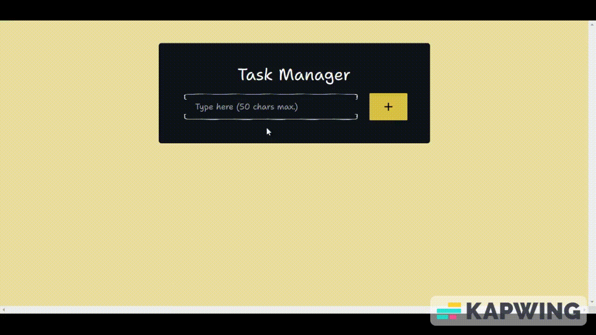

# Task Manager - A Responsive Todo Application



[](https://opensource.org/licenses/MIT)

Task Manager is a responsive ToDo application built with React and Firebase. It allows you to create, and delete tasks, and marks them as complete when you're done. The application is easy to use and provides a clean and simple interface.

## Built with

- ReactJS
- Firebase

## Getting Started

### Prerequisites

To run Task Manager, you'll need to have the following software installed on your machine:

- Node.js
- NPM

### Installing

To get started, follow these steps:

#### 1.  Clone the repository:

```node
git clone https://github.com/dboatengg/task-manager.git
```

#### 2.  Install the dependencies:

```node
npm install
```

#### 3.  Set up Firebase. Below are the steps to setup firebase (for those who are not familiar with Firebase and want to try out the project):
- Go to the Firebase Console (console.firebase.google.com).
- Click "Create a project".
- Enter a name for your project.
- Click on the "Create project".
- Click on the "Continue" to go to the project dashboard.
- Click on the "Web" icon to add a web app to your Firebase project.
- Give your app a name
- Register your app by following the instructions on the screen. 
- Once you've registered your app, you'll be provided with a Firebase configuration object that contains your app's API keys and other configuration details.
- Copy the Firebase configuration object into a JavaScript file `firebase.js` within the `src` directory of your project:

#### 4.  Start the application:

```node
npm run dev
```

The application should now be running on [http://localhost:3000](http://localhost:3000/).

## Contributing

If you'd like to contribute to Task Manager, feel free to fork the repository and submit a pull request.

## Author

- GitHub: [dboatengg](https://www.github.com/dboatengg)
- Twitter: [alege_dev](https://www.twitter.com/alege_dev)
- Instagram: [alege_dev](https://www.instagram.com/alege_dev)

## License

This project is licensed under the MIT License - see the [LICENSE](LICENSE.md) file for details.
